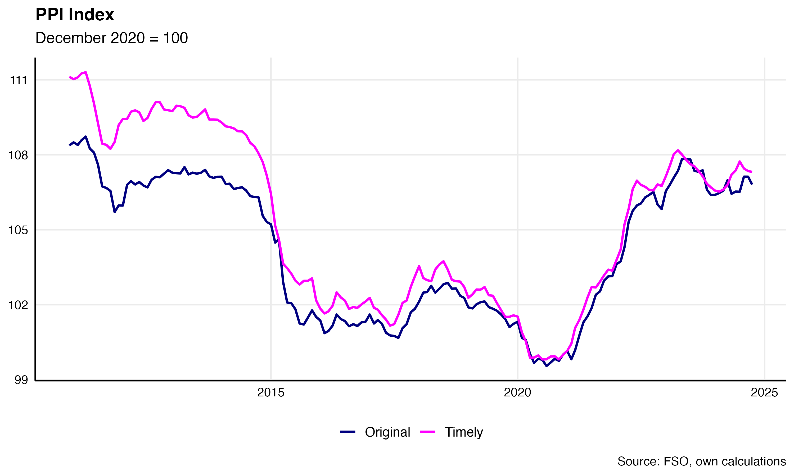
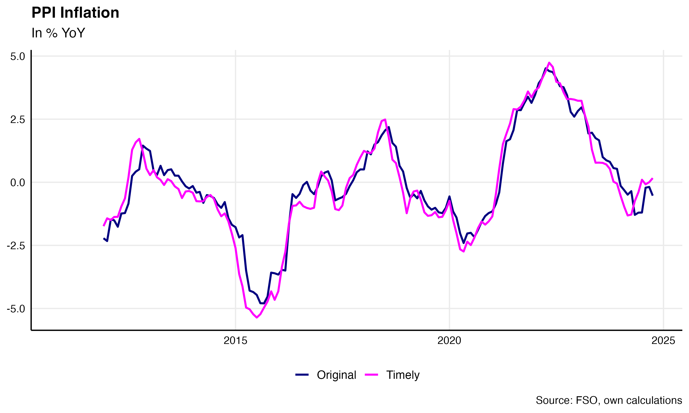

# timelyPPI
## Calculate timely Swiss producer prices

**Description:**  Producer prices in Switzerland are lagged. On the one hand, price surveys of companies are mostly not conducted every month. If no survey is conducted in a iven month, the value of the previous month is adopted. On the other hand, there are sectors where surveys are conducted in the first quarter of the year, for example, but the results are only included in the index one month after the quarter ends. Under the (plausible) assumption that prices are rigid and basically do not change very quickly, this procedure works quite well. However, there are always events that cause prices to change quickly. For example, when the Swiss National Bank abolished the minimum exchange rate against the euro and the Swiss franc appreciated strongly. Also currently the strong increase in oil prices caused by the Covid-19 crisis on the one hand and the Ukraine war on the other hand might lead to quicker than normal changes of prices. This repository contains code and data for a more realistic, timely PPI.

**Author:** [Burri](https://www.linkedin.com/in/marc-burri-a64628196/) Marc

## Download current data and other useful information
[Time Series timelyPPI (csv)](./timelyPPISeries.csv) | [Metadata timelyPPI (csv) ](./timelyPPIMeta.csv)  | [Detailed description](https://marcburri.github.io/posts/2019/12/18/timely-ppi/) | [Web application](https://mxbu.shinyapps.io/ppiapp/) 

The updated timely PPI is available monthly, shortly after the FSO published the most recent data.
 
## Current timely PPI:

